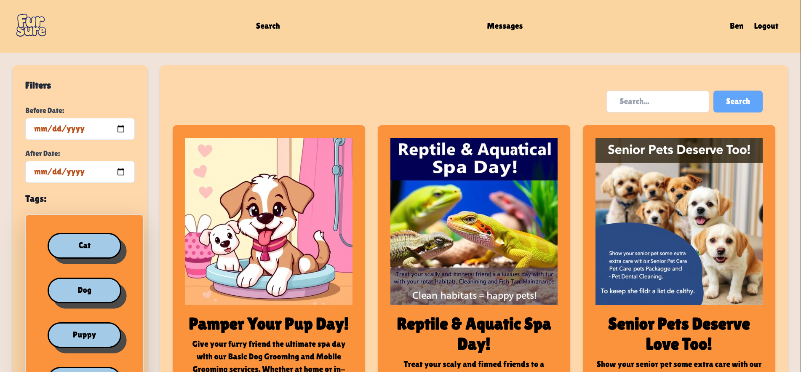

# 🐾 CS4116 Group Project: The Magical Pet Marketplace 🐉

Welcome to **The Magical Pet Marketplace**, a whimsical yet professional platform where businesses can advertise their pet grooming services. Whether you're looking to pamper your dog, fluff up your cat, or even groom your unicorn or dragon, we've got you covered! ✨

This project is part of our CS4116 coursework, and we hope you enjoy exploring this magical world of pet care.



---

## 🌟 About the Project

The Magical Pet Marketplace is designed to be:

- **Playful**: Catering to all pets, real and imaginary (yes, unicorns and dragons too! 🦄🐉).
- **Professional**: Built with clean code and thoughtful design to meet the requirements of a school project.
- **Functional**: A fully operational marketplace for businesses offering animal care services.

---

## 🛠️ Set Up

To get the project running locally, follow these simple steps:

1. **Clone the Repository**  
   Pull the repository to your local machine:
   ```bash
   git clone https://github.com/your-repo-url.git

2. **Navigate to the Root Directory**
   Open your terminal and navigate to the root directory of the project:
   ```bash
   cd CS4116_Group_Project

3. **Run the Server**
   Use Docker to spin up the server:
   ```bash
   docker-compose up

4. **Access the Website**
   Open your browser and head to:
   ```
   http://localhost:8080
   ```
   Voilà! You’re now ready to explore the magical world of pet grooming services.

---

## 📚 Documentation

For more details about the project structure and design decisions, check out the following resources:
- All ```.excalidraw``` files are intended to be viewed at [Excalidraw](https://excalidraw.com/) . These diagrams provide insights into the architecture and workflows of the project.